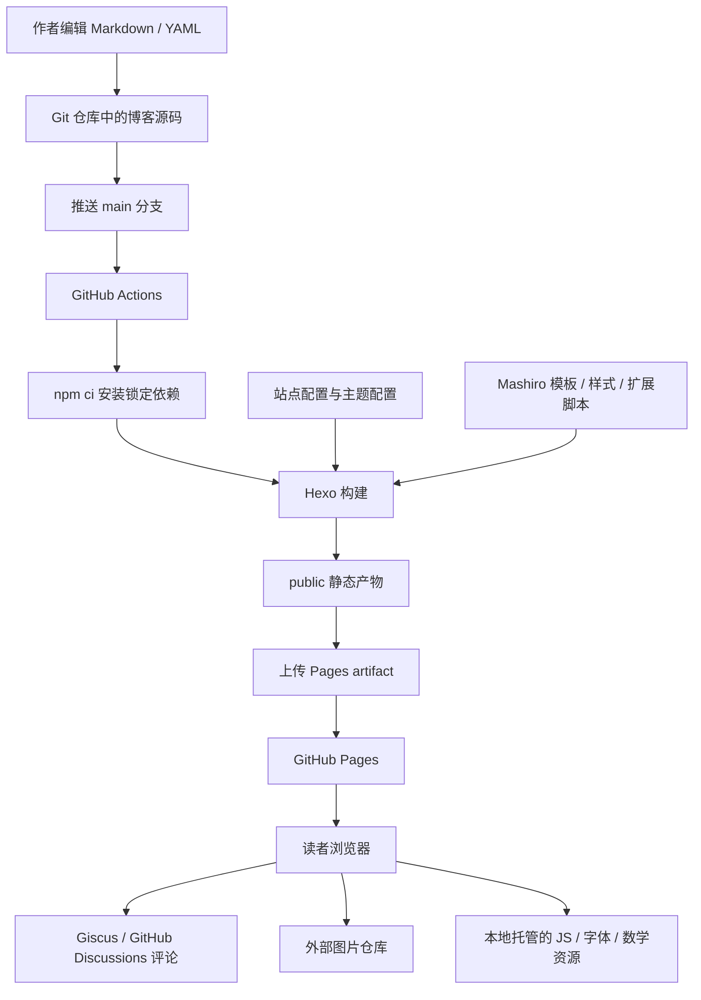

# A NEW AREA 个人博客源码框架总结

> 历史快照：本文记录重构前的代码状态。当前功能与操作方式请查看同目录的《内容管理与维护指南.md》。原文保留用于对照，不代表重构后的配置。

> 分析日期：2026-09-16  
> 分析对象：当前 `my-blog` 工作目录，分析时 Git 提交为 `f68c678`。  
> 分析方法：阅读项目配置、内容、主题模板、样式、脚本和部署流程，并执行本地构建、检查生成页面。  
> 范围说明：本文描述本地代码能够证明的结构与行为，未查询线上网站、GitHub 仓库可见性、Pages 设置或实际部署记录。文中改进建议尚未实施；文章正文及实际密码不在本文中转录。

## 1. 总体判断：以内容为中心的静态发布系统

这个项目是一个以 **Hexo 为构建核心、Mashiro 为展示主题、GitHub Actions 为发布流水线、GitHub Pages 为静态托管平台** 的个人博客。网站名称为 **A NEW AREA**，目前围绕文章阅读、图片展示和评论交流组织功能。

从整体架构看，它可以分成三条主线：

1. **内容生产线**：作者编辑 Markdown 文章、独立页面和 YAML 数据，通过 Git 保存修改。
2. **页面生产线**：Hexo 读取内容与配置，调用插件、EJS 模板和 Stylus 样式，生成 `public/` 中的静态文件。
3. **内容分发线**：GitHub Actions 构建并上传这些文件，GitHub Pages 向浏览器提供页面；评论和外链图片由其他服务提供。

这里“使用 GitHub 作为服务器”的具体含义，是使用它的仓库管理、自动构建和静态托管能力。当前代码中没有需要在服务器持续运行的博客应用进程，也没有自行维护的业务数据库、登录后台或文章管理 API。

**最重要的总体性观点是：本项目的核心资产是内容、配置和主题源码，网页是这些资产经过构建得到的结果。** 因此，维护时应该修改生成网页的源头，而不是直接修改 `public/` 内的 HTML。

现有结构适合个人长期写作：内容文件容易迁移，发布步骤固定，运行环节较少。其主要维护成本集中在主题定制、功能配置一致性，以及浏览器对外部评论和图片服务的依赖。

## 2. 架构全景与系统边界



本地预览与这条发布流程共享同一套内容、模板和构建工具，只是通过 `hexo-server` 在本机提供访问入口，不经过 Pages 发布。

| 层次 | 当前实现 | 负责的事情 | 关键边界 |
| --- | --- | --- | --- |
| 内容层 | Markdown、Front Matter、YAML | 文章、页面、图片清单等原始资料 | 不承担服务器端业务逻辑 |
| 配置层 | 站点 `_config.yml`、主题 `_config.yml` | 地址、路由、导航、主题功能开关 | 配置有对应消费者才会生效 |
| 构建层 | Node.js、Hexo、生成器与渲染器 | 解析内容、组织页面、输出资源 | 主要在作者本机或 Actions 中运行 |
| 展示层 | EJS、Stylus、浏览器 JavaScript | 排版、文章列表、导航与交互 | EJS 在构建时执行，交互脚本在浏览器执行 |
| 发布层 | GitHub Actions、GitHub Pages | 自动构建、上传与托管 | 当前工作流由 `main` 分支推送触发 |
| 外部能力 | Giscus、图片仓库 | 评论持久化和图片文件供应 | 可用性不完全由本站源码控制 |

## 3. 目录结构：哪些是源头，哪些是产物

以下保留主要结构，省略大量字体、第三方库文件及编辑器内部配置。

```text
my-blog/
├── .github/
│   ├── workflows/deploy.yml       # 构建并发布到 GitHub Pages
│   └── dependabot.yml             # npm 依赖更新检查
├── _config.yml                   # 当前站点配置
├── _config.landscape.yml         # 空文件，非当前主题的配置
├── package.json                  # 依赖声明与常用命令
├── package-lock.json             # 精确锁定依赖版本
├── .gitignore                    # 不纳入版本管理的文件规则
├── scaffolds/
│   ├── post.md                   # 新文章模板
│   ├── page.md                   # 新独立页面模板
│   └── draft.md                  # 新草稿模板
├── source/
│   ├── _posts/                   # 博客文章，当前 2 篇
│   ├── _data/
│   │   ├── gallery.yml           # 首页图库预览的数据源
│   │   └── thoughts.yml          # 短句文本，目前未被模板引用
│   └── gallery/index.md          # 独立图库页，含 HTML 与 CSS
├── scripts/
│   └── giscus.js                 # 构建时向文章页注入评论脚本
├── themes/
│   └── mashiro/
│       ├── _config.yml           # 当前实际使用的主题配置
│       ├── _config.sample.yml    # 主题配置示例
│       ├── layout/               # EJS 页面及公共片段
│       ├── scripts/              # 主题构建扩展
│       ├── source/               # 样式、脚本、字体、数学及灯箱资源
│       ├── languages/            # 多语言文本
│       └── README.md 等          # 主题自带文档
├── node_modules/                 # 已安装依赖，可由锁文件恢复
├── public/                       # 生成网页与资源，可重新构建
├── db.json                       # Hexo 本地缓存，不是线上业务数据库
└── bolg_log/
    └── 博客源码框架总结.md         # 本文
```

### 3.1 必须长期保存的部分

`source/`、`themes/mashiro/`、`scripts/`、配置文件、依赖声明与锁文件、工作流和 `scaffolds/` 共同构成站点的可恢复源码。

尤其要注意：当前 Mashiro 已经包含首页、评论等定制，不能把整个主题目录简单视为随时可以从上游覆盖的第三方依赖。

### 3.2 可以重新生成的部分

`node_modules/`、`public/`、`db.json` 已被 `.gitignore` 排除。它们分别属于安装结果、构建结果和本地缓存。

项目通过 Actions 上传 `public/`，不要求把该目录提交到源码仓库。

### 3.3 文档与博客内容的关系

本站的内容入口是 `source/`。本文放在项目根目录下的 `bolg_log/`，按当前构建配置，不会作为博客文章或站点页面自动发布。

## 4. 技术栈和依赖职责

以下版本来自当前 `package-lock.json`，不是对软件最新版本的判断。

| 组件 | 锁定版本 | 在本项目中的职责 |
| --- | --- | --- |
| Hexo | 8.1.2 | 管理配置、内容模型、插件、模板和静态输出 |
| hexo-generator-index | 4.0.0 | 生成首页文章列表和分页 |
| hexo-generator-archive | 2.0.0 | 生成年、月和总归档页 |
| hexo-generator-category | 2.0.0 | 根据文章分类生成分类页面 |
| hexo-generator-tag | 2.0.0 | 根据文章标签生成标签页面 |
| hexo-renderer-marked | 7.0.1 | 将 Markdown 渲染为 HTML |
| hexo-renderer-ejs | 2.0.0 | 执行 EJS 页面模板 |
| hexo-renderer-stylus | 3.0.1 | 将 Stylus 编译成 CSS |
| hexo-server | 3.0.0 | 提供本地预览服务 |
| hexo-blog-encrypt | 4.0.2 | 构建时加密指定文章，输出浏览器解密界面 |
| hexo-theme-landscape | 1.1.0 | 已安装，但当前站点没有选用这个主题 |

浏览器端另有随主题提交的 jQuery 1.4.3、Fancybox 1.3.4、ClipboardJS，以及 MathJax、KaTeX 和字体资源。这些文件中的许多不是由根目录 npm 依赖清单管理的，因此 Dependabot 的 npm 更新检查不能覆盖全部前端资源。

### 4.1 生成器、渲染器与主题的分工

- **生成器决定有哪些页面**：例如首页第几页、哪些月份有归档、哪些标签需要入口。
- **渲染器负责文件格式转换**：例如 Markdown 转 HTML、Stylus 转 CSS。
- **主题决定页面如何组成和显示**：例如文章标题、正文、上下篇导航与评论的位置。
- **扩展脚本介入构建流程**：例如处理标点、增加文章标签语法、注入评论脚本。

理解这组分工，有助于定位问题：页面不存在先看内容与生成器，页面内容不对先看渲染和插件，排版不对再看模板和样式。

### 4.2 项目实际配置优先于主题说明书

主题 README 建议使用 `hexo-renderer-markdown-them`，并介绍根目录 `_config.mashiro.yml` 的配置方式；当前项目实际使用 **Marked 渲染器和主题目录内 `_config.yml`**。

README 的部分描述也存在前后不一致，例如概述写着暂不支持目录，但源码已有目录组件。因此不能直接把主题说明书中的全部特性，当成本站已经启用的能力。

## 5. 配置体系与地址规则

### 5.1 站点配置

根目录 `_config.yml` 控制站点整体行为。

| 配置 | 当前值 | 含义 |
| --- | --- | --- |
| `title` | `A NEW AREA` | 网站名称 |
| `subtitle` | `All you need is freedom and love.` | 副标题 |
| `author` | `travis` | 默认作者信息 |
| `language` | `zh-CN` | 主题内置文本使用简体中文 |
| `timezone` | `Asia/shanghai` | 日期处理的时区配置原值 |
| `url` | `https://travisforfree.github.io/anewarea` | 站点完整地址 |
| `root` | `/anewarea/` | 项目站点的访问路径前缀 |
| `permalink` | `:year/:month/:day/:title/` | 文章永久链接格式 |
| `theme` | `mashiro` | 实际使用的主题 |
| `index_generator.per_page` | `3` | 首页每页最多 3 篇文章 |
| `index_generator.order_by` | `-date` | 首页按发布日期倒序排列 |
| `per_page` | `10` | 通用分页大小，其他生成器按各自规则使用 |
| `render_drafts` | `false` | 正常生成时不公开草稿 |
| `future` | `true` | 允许生成发布日期在未来的文章 |
| `post_asset_folder` | `false` | 未启用每篇文章独立资源目录 |
| `syntax_highlighter` | `highlight.js` | 使用 Hexo 的代码高亮流程 |
| `deploy.type` | 空 | 没有配置 Hexo 自带部署适配器 |

### 5.2 为什么 `/anewarea/` 很重要

这套配置对应项目路径下的网站。浏览器访问页面和资源时，需要带上 `/anewarea/` 前缀。

主题多数内部链接使用 `url_for()`，样式和脚本使用 `css()`、`js()` 辅助函数。它们把源码中的站内路径转换为符合站点配置的地址。本次生成页面中的主样式地址是 `/anewarea/css/style.css`。

以后修改仓库名、站点路径或绑定域名时，需要一起检查 `url`、`root`、自定义链接和评论映射。直接把 `/css/style.css` 写死在模板中，可能绕开项目路径前缀。

### 5.3 主题配置

`themes/mashiro/_config.yml` 控制展示功能：

| 功能 | 当前状态 | 具体表现 |
| --- | --- | --- |
| 导航 | Home、Gallery、Archives | 桌面导航和移动导航读取同一菜单配置 |
| About | 注释关闭 | 当前也没有对应内容页 |
| Fancybox | 开启 | 文章区图片可由前端脚本包装成灯箱链接 |
| 侧边栏和组件 | 未启用 | 当前布局不输出侧边栏 |
| 文章目录 | 能力开启、默认关闭 | 文章还需设置 `toc: true` |
| 数学公式 | 开启，使用 MathJax | 通用页面会引用 MathJax |
| KaTeX | 资源存在，当前未选用 | 是可切换的另一条渲染路径 |
| Valine | 关闭 | 当前实际评论由 Giscus 提供 |
| 标题编号 | `config` | 文章设置 `title-number: true` 时启用相应样式 |
| 引用块 | `grey` | 使用灰色引用块样式 |
| RSS、favicon | 配置被注释 | 当前未启用相关入口 |
| 版权 | 固定为 2026 年文字 | 后续年份需要人工维护，或改为动态年份 |

## 6. 内容模型：文章、页面和数据

### 6.1 文章

文章放在 `source/_posts/`，文件开头的 Front Matter 描述元信息，后面是正文。

```markdown
---
title: 示例文章
date: 2026-09-16 20:00:00
tags:
  - 随笔
toc: true
---

这里是首页显示的摘要。

<!-- more -->

这里开始正文的其余部分。
```

字段并不只是用于显示：`date` 决定排序、归档与日期路径，`tags` 参与标签页面生成，`toc` 参与主题条件判断。文件名通常影响文章 slug，Front Matter 的 `title` 负责显示标题；两者不必一致。

当前有两篇文章：

| 文件 | 结构特征 | 对页面的影响 |
| --- | --- | --- |
| `START.md` | 含日期、标签和 `<!-- more -->` | 首页显示摘要，详情页显示全文 |
| `loneliess and solitude.md` | 含日期、标签及加密相关字段 | 首页显示加密摘要，详情页提供解密入口 |

第二篇文件名中的 `loneliess` 拼写和空格已经进入生成路径。若后续为了整理文件名而修改它，应同时考虑已有文章链接及按路径关联的评论。

当前两篇文章都没有声明分类，实际产物中也没有分类页。项目已经具备分类生成器，但这不代表已经存在分类内容。

### 6.2 独立页面

`source/gallery/index.md` 是独立页面，生成 `gallery/index.html`。它通常不进入首页文章列表，而通过导航和首页图库入口被访问。

这个文件同时包含：

- 页面标题、日期与 `type: "gallery"`；
- 内嵌 CSS；
- 日期标题；
- 手写图片网格 HTML 和外链图片地址。

需要特别区分：`type: "gallery"` 在这里是元数据，当前代码没有读取它的图库生成器，也没有专门的 `gallery.ejs`。图库的特殊外观来自页面内的 HTML/CSS，整体仍复用普通页面的文章组件。

### 6.3 YAML 数据文件

`source/_data/gallery.yml` 是图片对象列表，当前只有一项，包含 `url` 与 `date`。Hexo 将它提供给模板的 `site.data.gallery`。

首页会读取该数组的前 3 项，但当前没有按 `date` 排序，也不展示这个日期字段。因此实际展示顺序取决于 YAML 中的排列顺序。

`source/_data/thoughts.yml` 当前是一个 YAML 字符串，而不是对象列表。首页没有引用 `site.data.thoughts`，显示的短句直接写在 `layout/index.ejs` 中。修改该数据文件不会自动改变首页短句。

### 6.4 内容组织的总体评价

文章部分已经形成清晰的“内容文件—通用模板”关系；图库和短句部分还处在局部定制阶段。

图库清单负责首页预览，图库页面却另写一份图片 HTML，这意味着同一张图片需要在两处维护。让两种视图读取同一份 YAML，是下一步降低维护成本最直接的办法。

## 7. 页面模板体系与渲染调用关系

### 7.1 整站外壳

`themes/mashiro/layout/layout.ejs` 定义共享页面框架：

```text
layout.ejs
├── _partial/head.ejs             标题、元信息、字体、CSS、可选数学资源
├── _partial/header.ejs           导航、主标题、副标题
├── #content
│   ├── #main → body              当前页面模板的渲染结果
│   └── _partial/sidebar.ejs       条件启用的侧边栏
├── _partial/footer.ejs           页脚
├── _partial/mobile-nav.ejs       移动导航
└── _partial/after-footer.ejs      公共脚本与可选服务初始化
```

这里的 `body` 是构建阶段插入的页面 HTML。每次浏览器打开链接，主要是在加载已经生成好的 HTML 文件，没有前端单页应用路由接管整站页面。

### 7.2 各类页面的入口

| 模板入口 | 使用方式 | 核心复用组件 |
| --- | --- | --- |
| `index.ejs` | 首页及首页分页 | `_partial/article` |
| `post.ejs` | 文章详情 | `_partial/article`，`index: false` |
| `page.ejs` | 普通独立页面，包括当前图库 | `_partial/article`，`index: false` |
| `archive.ejs` | 总归档、年归档、月归档 | `_partial/archive` |
| `tag.ejs` | 标签文章列表 | `_partial/archive` |
| `category.ejs` | 分类文章列表 | `_partial/archive` |
| `about.ejs` | 预留的关于页样式 | `_partial/about` |
| `404.ejs` | 预留的错误页模板 | 直接输出页面内容 |

拥有模板不等于拥有路由。当前没有 `source/about/index.md` 和 404 内容页，本次生成结果也没有对应页面。

### 7.3 首页如何组成

当前 `index.ejs` 是定制最明显的文件，包含三大区域：

1. **短句区**：显示写在模板中的英文短句。
2. **Article 区**：遍历当前页的 `page.posts`，调用文章组件；标题链接到归档；需要时显示分页。
3. **Gallery 预览区**：数据存在时，从 `site.data.gallery` 取前 3 项，图片都链接到完整图库页。

首页还包含标题悬停/按压动画和滚动时主副标题渐隐的脚本。由于这些内容都在首页模板中，后续文章数量超过 3 篇后，首页分页也会复用这些区域。

### 7.4 文章组件是展示核心

`_partial/article.ejs` 负责日期、分类、可选头部图片、标题、目录、正文、标签、上下篇导航和评论。

其关键开关是传入的 `index`：

- `index: true` 且存在 `post.excerpt`：输出摘要和阅读全文链接。
- 没有摘要时：直接输出 `post.content`，所以普通文章不写摘要分隔符可能在首页显示全文。
- `index: false`：输出正文，尝试显示上下篇导航，并插入评论区域。

目录还有独立条件：必须是文章详情页、主题允许目录，并且符合默认开关或文章的 `toc` 设置。当前默认关闭，普通文章需显式开启。

### 7.5 归档与多语言

归档、标签、分类复用 `_partial/archive.ejs`，当前默认表现为按年份分组的简洁文章链接列表，需要时追加分页。

`languages/` 提供日期导航、归档、标签、目录等界面文本。站点设为 `zh-CN`，但 Home、Gallery、Archives 菜单名和首页 Article 等文字是自行写入的英文，因此界面呈现中英混合是当前配置与模板共同决定的。

## 8. 样式系统与浏览器交互

### 8.1 样式的主干

`themes/mashiro/source/css/style.styl` 是样式入口，依次引入变量、布局工具、公共样式，以及文章、导航、归档、移动端、目录等模块。

| 文件或目录 | 主要修改内容 |
| --- | --- |
| `_variables.styl` | 颜色、字号、字体、布局参数和断点 |
| `_extend.styl` | 公共文字样式、标题编号、页面宽度规则 |
| `_partial/header.styl` | 导航、站点标题和副标题 |
| `_partial/article.styl` | 文章元信息、正文、标签、图片和上下篇导航 |
| `_partial/highlight.styl` | 代码块样式 |
| `_partial/mobile.styl` | 移动导航 |
| `_partial/toc.styl` | 文章目录 |
| `_partial/biaodian.styl` | 中文标点排版 |
| `fonts/` | 中文分片字体、Latin Modern 和图标字体等 |

整体视觉方向是白底、较窄正文、衬线字体和偏学术的中文排版。常规无侧边栏布局宽度以 `44em` 为基础，并通过多组媒体查询适应较窄屏幕。

现有响应式能力主要由主题承担。不过首页图库使用内联固定三列布局，不会自动采用独立图库页的 `auto-fill / minmax(280px, 1fr)` 网格规则。两处图库在窄屏上的表现需要分别验证。

### 8.2 样式目前分布在三个位置

除 Stylus 主干外，首页模板内写有 `<style>` 和大量 `style` 属性，图库 Markdown 内也写有 `<style>`。

这样做便于快速实现页面，但会使一次视觉调整涉及模板、内容和样式三个位置。随着功能增长，适合把页面专属样式迁到独立 Stylus 模块，让 Markdown 主要描述内容。

### 8.3 通用浏览器脚本

`themes/mashiro/source/js/script.js` 主要负责：

1. 为文章区图片补充说明文字并包装灯箱链接。
2. 存在 Fancybox 插件时初始化图片灯箱。
3. 切换移动端导航状态。
4. 给代码块添加复制按钮，调用 ClipboardJS。

图片遍历同时覆盖 `.article-entry` 和 `.article-inner`，但通过判断图片是否已经在链接中避免再次包装。当前图库页也位于文章组件中，因此会受到这段图片增强逻辑影响。

首页的滚动渐隐逻辑是另一段内联脚本：每次滚动遍历多类元素，再用完整站点标题文字判断目标。它与站点名称存在耦合，也重复进行了不必要的元素查找。后续可以直接缓存已有的 `#logo`、`#subtitle` 等目标元素。

代码复制功能目前在每个代码块循环内创建针对统一选择器的 ClipboardJS 实例；当代码块较多时，可以考虑统一初始化一次。

## 9. 构建扩展、评论、数学和加密

### 9.1 两类脚本目录不能混淆

| 位置 | 运行阶段 | 当前例子 |
| --- | --- | --- |
| 根目录 `scripts/` | Hexo 构建阶段 | 注册 Giscus HTML 注入 |
| `themes/mashiro/scripts/` | Hexo 构建阶段 | 中文标点处理、Fancybox 标签 |
| `themes/mashiro/source/js/` | 读者浏览器 | 图片灯箱、移动导航、复制按钮 |

例如 `scripts/giscus.js` 自身不会直接作为站点 JS 文件发送给浏览器；它注册构建规则，把需要浏览器执行的 `<script>` 标签写进生成的 HTML。

### 9.2 中文标点与 Fancybox 标签扩展

`transpunc.js` 注册 `before_post_render` 过滤器，在 Markdown 渲染之前，把部分中文标点转换为带有 `bd-box`、`h-char` 和 `h-inner` 的 HTML 结构，再由标点样式处理显示效果。

这一实现是对原始内容字符串做正则替换，没有按 Markdown 语法区分代码块、内联代码和普通正文。对文学随笔主要体现为排版处理；若以后写技术文章，包含中文标点的代码和原始 HTML 应作为重点检查对象。

`fancybox.js` 注册 `` 自定义标签，用于在写作阶段声明图片、缩略图和说明。这与浏览器自动包装图片是两条不同入口。

### 9.3 Giscus 评论架构与重复接入

当前评论配置关联仓库 `travisforfree/anewarea` 的 `General` 分类，使用 `pathname` 作为评论映射依据，语言为 `zh-CN`，主题跟随用户偏好的配色。

代码中存在两处接入：

| 接入位置 | 条件 | 对生成结果的影响 |
| --- | --- | --- |
| `scripts/giscus.js` | Injector 的目标类型为 `post` | 文章页 `body_end` 追加一份客户端脚本 |
| `_partial/article.ejs` | `!index` | 文章详情和普通独立页面追加一份客户端脚本 |

本次生成结果确认：两篇文章页各有 **2 个 Giscus 客户端脚本标签**，图库页有 **1 个**，首页和归档页没有。

这能证明存在重复初始化入口，但本次没有进行浏览器联网验证，因此不把它直接等同于已经观察到两个评论框。合理的整理方向是统一一处评论组件和一份配置，并明确文章、图库是否分别允许评论。

此外，当前两个入口都没有把文章 `comments: false` 当作开关。单独在 Front Matter 中添加这个字段，不能据此认定 Giscus 就会关闭。

由于评论按路径关联，文章日期、slug 或站点根路径变化可能改变评论关联。文章链接因此也是评论系统的数据标识，值得保持稳定。

### 9.4 数学公式

主题包含 MathJax 和 KaTeX 两套资源，并通过 `theme.math.engine` 选择页面加载哪一套。

当前配置为 `mathjax`。`after-footer.ejs` 设置行内及块级公式分隔符，加载本站的 `mathjax/tex-chtml.js`。本次生成的 9 个博客页面均包含该引用。

当前是站点级开关，没有按文章是否需要公式来决定加载。对以随笔为主的内容，可以考虑以后按文章启用。KaTeX 虽未被当前模板分支引用，其资源仍会进入静态输出目录。

### 9.5 文章加密

`hexo-blog-encrypt` 在文章 HTML 渲染之后执行处理，根据文章密码或标签密码配置决定是否加密，再输出密文、提示界面和解密资源。浏览器拿到静态页面后，使用读者输入完成本地解密。

对当前安装的 4.0.2 版本，源码中实际判断来自密码相关配置；站点中的 `encrypt.enable: true` 不能理解为“所有文章都会加密”，也不能仅通过修改这个字段推断已关闭加密。

当前加密文章配置了密码、首页摘要 `abstract` 和页面提示 `message`。插件把正文替换为解密界面，并将文章摘要替换为配置的提示文本。本次生成结果确认该文章存在加密容器，但未进行浏览器输入密码和完整解密体验验证。

**加密作用于生成的阅读页面，不会自动加密 Git 仓库中的 Markdown。** 当前文章源文件中保存了正文和密码字段。如果源码仓库公开，访问源码的人仍可能直接读到它们；本次未查询该仓库的实际可见性。这是理解当前架构的数据边界所必需的区别。

## 10. 一篇文章从文件到网页的完整过程

以新增普通文章为例，流程可以概括为：

1. 作者在 `source/_posts/` 创建 Markdown，填写标题、日期、标签等字段。
2. Hexo 读取站点配置、主题配置、内容和数据文件，建立文章及页面模型。
3. 主题的构建过滤器预处理正文，例如替换中文标点。
4. Markdown 渲染器将正文变成 HTML，相关插件按需要继续处理，例如文章加密。
5. 生成器根据文章集合确定首页、归档、标签和文章详情路由。
6. EJS 模板将这些数据组织进页面外壳与公共组件。
7. Injector 在生成 HTML 中加入匹配页面类型的片段，例如文章评论脚本。
8. Stylus 编译为 CSS，主题资源和插件资源进入 `public/`。
9. 构建产物交给 Pages；读者访问时，浏览器再执行灯箱、公式、评论和解密等交互。

这说明一篇新文章除了增加详情页，还可能同时改变首页顺序、归档列表、标签页面和已有文章的上下篇导航。

## 11. GitHub 自动构建与发布机制

核心文件为 `.github/workflows/deploy.yml`。

### 11.1 触发与权限

- 触发条件：向 `main` 分支推送。
- 当前没有配置 `pull_request` 构建或 `workflow_dispatch` 手动触发入口。
- 权限声明：读取仓库内容、写入 Pages、获取部署所需的身份令牌。
- 并发组：`pages`，新运行可以取消同组仍在执行的旧运行。

### 11.2 构建任务

`build` 任务运行在 `ubuntu-latest`：

1. `actions/checkout@v4` 拉取源码，开启 `submodules: true`。
2. `actions/setup-node@v4` 安装 Node.js 20。
3. `npm ci` 根据锁文件安装依赖。
4. `npx hexo generate` 生成站点。
5. `actions/upload-pages-artifact@v3` 上传 `./public`。

仓库中没有被跟踪的 `.gitmodules`，主题文件本身由当前仓库跟踪，因此目前不能把 Mashiro 解释为通过子模块维护的主题。

### 11.3 部署任务

`deploy` 依赖 `build` 成功完成，在 `github-pages` 环境中通过 `actions/deploy-pages@v4` 发布构建产物，并把部署地址写入环境输出。

源码表达的是完整的 Pages 发布流程；实际能否在线发布，还取决于仓库权限、Pages 来源设置及运行结果，本次未远程核实。

### 11.4 命令名称与实际职责

`package.json` 提供：

| 命令 | 实际调用 | 用途 |
| --- | --- | --- |
| `npm run build` | `hexo generate` | 生成静态网站 |
| `npm run clean` | `hexo clean` | 清理生成结果和缓存 |
| `npm run server` | `hexo server` | 本地预览 |
| `npm run deploy` | `hexo deploy` | 调用 Hexo 部署流程，但当前没有部署类型配置 |

**本站实际的自动发布入口是推送 `main` 后运行的 GitHub Actions。** 不能因为存在 `npm run deploy`，就认定它已经能够直接发布到当前 Pages。

### 11.5 依赖可重复性

CI 使用 `npm ci`，锁文件能让同一份源码安装到一致的依赖版本。当前 Hexo 的锁定元数据要求 Node.js 至少为 `20.19.0`；工作流只指定了主版本 `20`，没有固定小版本。

本次本地构建使用 Node.js `24.18.1`、npm `11.16.0`。本地成功说明当前环境能够完成构建，但不能替代工作流 Node.js 20 环境中的验证。

## 12. 静态资源、外部依赖和功能边界

### 12.1 外部资源

目前图库图片指向 `raw.githubusercontent.com` 上另一个 `blog-images` 仓库。页面生成成功，只能说明图片 URL 被写入了 HTML，不能证明读者一定能访问到图片。

当前主要外部运行依赖是 Giscus 评论服务与外链图片；主体文章、样式、字体、jQuery、灯箱和数学资源来自本站发布的静态文件。

Valine、Disqus 和统计服务虽然保留了模板代码，但没有满足当前配置的启用条件，不应算作本站正在使用的服务。

### 12.2 资源体量

本次本地构建后，现有 `public/` 目录包含 **545 个文件、约 15.54 MiB**。这是当前目录快照，构建采用增量生成，没有先清空目录，不能把它当作全新 CI 产物的逐字节基准。

主题源资源的大致分布如下，体积为未压缩文件大小，按 MiB 计算：

| 主题资源目录 | 文件数 | 合计体积 |
| --- | --- | --- |
| `source/css/`，包含字体和样式源码 | 415 | 约 11.03 MiB |
| `source/katex/` | 81 | 约 2.83 MiB |
| `source/mathjax/` | 26 | 约 1.39 MiB |
| `source/fancybox/` | 25 | 约 0.09 MiB |
| `source/js/` | 3 | 约 0.08 MiB |

总体上，仓库资源规模主要由字体和数学库决定，而不是文章文字决定。**文件总量不等于单页实际下载量**：浏览器只请求页面引用、动态加载或字体匹配所需的资源，还会受到缓存和传输压缩影响。

本次输出还存在 `katex/README.html`，说明第三方资源目录中的说明文件也进入了生成结果。可以在后续资源整理时检查发布目录是否包含不需要对外提供的文件。

### 12.3 当前没有实现的能力

代码中没有发现本站自行实现的管理后台、用户账户系统、搜索索引、站内搜索界面或专用业务 API。RSS 与 sitemap 也未配置相应生成插件。若以后需要这些功能，应分别判断是继续通过静态构建实现，还是接入外部服务。

## 13. 架构优点与维护问题

### 13.1 已有优点

1. **内容与托管平台分离。** 文章是 Markdown，静态输出可以迁移到其他支持静态文件的平台。
2. **发布流程可以追踪。** 源码、主题定制和工作流都在同一 Git 仓库中。
3. **核心页面具有复用关系。** 文章与普通页面复用文章组件，归档、标签与分类复用列表组件。
4. **阅读风格明确。** 字体、正文宽度和标点处理围绕长文阅读设计。
5. **多数扩展沿用 Hexo 机制。** 通过过滤器、标签、注入器和生成器扩展功能，无需修改 Hexo 核心。
6. **评论与主体托管解耦。** 不需要为了评论单独维护博客后端。

### 13.2 需要优先关注的事项

下表的“已确认”表示源码或本地构建可以直接证明；“待验证”表示还需要浏览器、线上环境或特定内容样例。

| 事项 | 证据与判断 | 维护影响 | 建议 |
| --- | --- | --- | --- |
| Giscus 重复接入 | 已确认文章页含两份客户端脚本 | 配置容易分歧，存在重复初始化可能 | 统一评论片段与配置，增加页面级开关 |
| 图库两份内容来源 | 首页读 YAML，独立图库写 HTML | 加图容易只更新一个入口 | 两处视图共同读取同一份数据 |
| 短句文件未连接首页 | 没有 `site.data.thoughts` 引用 | 修改数据文件不会改变显示 | 明确数据结构并接入模板，或去掉无效维护入口 |
| 主题已深度定制 | 首页、评论和样式均含本站实现 | 整体覆盖主题会丢失定制 | 更新前比较差异，逐步提取本站专属模块 |
| 标点过滤覆盖原始内容 | `before_post_render` 对全文正则替换 | 代码、公式和 HTML 兼容性待专项验证 | 保护代码片段或改为语法感知的处理 |
| 加密与源码可见性不同 | 加密文章源文件含正文和密码 | 页面加密无法遮蔽公开源码 | 先明确源仓库访问边界，再设计私密内容流程 |
| 数学脚本按站点加载 | 当前 9 个博客页面均引用 MathJax | 无公式页面也承担相关加载 | 根据文章字段按需引入 |
| 旧版前端库随主题保存 | jQuery、Fancybox 为本地第三方文件 | npm 依赖更新不能覆盖这部分 | 单独登记和评估兼容性，不直接盲目替换 |
| 首页交互依赖标题文本 | 滚动时遍历元素并匹配固定文字 | 改站名可能失效，重复查询 DOM | 使用稳定元素 ID，并缓存节点 |
| 首页图库固定三列 | 模板内联网格规则 | 移动端效果待浏览器检查 | 增加窄屏布局并补充图片替代文本 |
| Obsidian 文件仍被跟踪 | `git ls-files` 列出 `_posts/.obsidian/` 文件 | 忽略规则不会自动取消已跟踪文件 | 确认用途后再从版本跟踪中移除 |
| CI 缺少变更前预检入口 | 仅 `push main` 触发，没有 PR 构建 | 构建问题通常在进入发布分支后暴露 | 增加只构建不发布的变更检查 |

本次修改仅新增总结文档，没有代为调整以上实现。

## 14. 后续演进方向：先统一入口，再扩充能力

### 14.1 第一阶段：降低日常维护的不确定性

优先统一评论接入、图库数据源和短句数据入口。它们直接对应作者最常接触的操作：发文、加图、调整首页。完成后，应能够做到一次修改对应一个明确入口。

同时确认需要密码保护的内容应如何保存，以及博客源码仓库的可见性要求。这个决定会影响内容保存与发布方式，不能只依靠主题层处理。

### 14.2 第二阶段：梳理主题定制边界

可以逐步将首页短句、文章区、图库预览、评论拆分成公共片段，并把页面内联 CSS 与 JavaScript 迁入主题资源文件。目标是让文件职责更稳定：

- Markdown/YAML 负责内容与元数据。
- EJS 负责页面结构与条件判断。
- Stylus 负责外观。
- 浏览器脚本负责交互。
- 配置文件负责可调整参数。

这仍然可以保留 Hexo 与现有主题，不需要为了整理代码更换整个技术栈。

### 14.3 第三阶段：改善发布检查和阅读体验

结合实际内容增加构建检查、站内链接检查和代表性页面预览，再考虑数学资源按需加载、图片尺寸、懒加载及字体策略。先测量页面请求和显示效果，再决定删减资源。

如果以后技术文章明显增加，可以专门验证代码复制、目录、公式和标点处理的组合；如果图片数量增加，则优先完善图库数据结构、说明文字和分页或分组展示。

**演进重点应是减少重复维护与不清晰的隐式行为，而不是单纯增加插件数量。** 当前博客规模下，保持架构简单仍然有较大价值。

## 15. 日常维护定位速查

| 想完成的事情 | 应优先修改或查看的位置 | 关联注意点 |
| --- | --- | --- |
| 新增或修改文章 | `source/_posts/` | 日期、摘要、标签与链接稳定性 |
| 修改新文章默认字段 | `scaffolds/post.md` | 不会自动改变已有文章 |
| 修改站名、副标题、地址 | 根目录 `_config.yml` | 首页渐隐脚本目前另有固定标题文字 |
| 调整首页每页文章数 | `_config.yml` 的 `index_generator` | 通用 `per_page` 是另一个配置 |
| 修改导航或主题开关 | `themes/mashiro/_config.yml` | 导航存在不代表页面已经生成 |
| 修改首页结构和短句 | `themes/mashiro/layout/index.ejs` | 短句 YAML 当前不生效 |
| 增加首页预览图片 | `source/_data/gallery.yml` | 只显示列表前 3 项 |
| 修改完整图库 | `source/gallery/index.md` | 当前需要与首页数据人工同步 |
| 调整文章正文结构 | `themes/mashiro/layout/_partial/article.ejs` | 同时影响文章详情与普通独立页面 |
| 修改颜色、字号、字体 | 主题 CSS 的 `_variables.styl` 及具体模块 | 字体还受 `head.ejs` 和字体资源影响 |
| 修改图片灯箱、导航、复制 | `themes/mashiro/source/js/script.js` | 需要实际浏览器检查 |
| 排查评论 | `scripts/giscus.js` 与文章组件 | 当前两处都需要检查 |
| 排查中文标点显示 | `themes/mashiro/scripts/transpunc.js`、`biaodian.styl` | 同时涉及构建结果和 CSS |
| 排查自动部署 | `.github/workflows/deploy.yml` | 结合实际 Actions 日志定位阶段 |
| 更新依赖 | `package.json`、`package-lock.json` | 手工放入主题的库需要单独管理 |

本地常用操作，在项目根目录执行：

```powershell
# 安装锁文件规定的依赖，适用于首次获取源码或同步依赖后
npm ci

# 创建文章
npx hexo new post "文章文件名"

# 生成站点
npm run build

# 启动本地预览；访问地址以终端输出为准，并注意 /anewarea/ 前缀
npm run server
```

如果遇到旧缓存或旧生成文件残留，可在确认 `public/` 没有需要保留的手工内容后使用 `npm run clean`，再重新构建。正常发布仍通过源码提交并推送 `main` 完成。

## 16. 本次验证结果与结论边界

### 16.1 已完成的验证

- 阅读站点配置、锁定依赖、GitHub 工作流和忽略规则。
- 阅读内容文件结构、主题各页面入口、核心公共组件、主样式及自定义脚本。
- 对照当前安装的 Hexo Injector 与加密插件实现，确认页面注入范围和加密触发条件。
- 执行 `npm run build`，进程退出码为 `0`。
- 检查生成 HTML 的标题、主样式路径、Giscus 脚本数量、MathJax 引用和加密容器。

本次得到的核心博客页面为：首页 1 个、文章详情 2 个、图库 1 个、归档 3 个、标签 2 个，共 **9 个**。目录中另有 KaTeX 说明生成的 HTML，因此 HTML 文件总数为 **10 个**。

构建日志报告 **12 个文件生成**，这是该次增量构建实际写出的文件数，不是整个站点的文件总数。构建还移除了缓存中两条旧输出路径，属于本地生成结果更新。

构建出现一条加密插件警告，提示默认密钥派生迭代参数为 `250000` 并建议提高。它没有阻止构建；本文只记录插件实际输出，未进行外部安全标准核验或加密强度审计。

### 16.2 尚未验证的部分

没有推送代码或触发线上部署，没有检查 GitHub Pages 后台、Giscus 实际讨论权限、远程图片可用性，也没有完成移动端视觉、公式、灯箱、复制按钮与密码解密的浏览器测试。因此，本地生成成功不应被扩大解释为所有线上功能已通过端到端验证。

### 16.3 最终架构评价

这份代码已经形成完整的个人博客发布链路：**文件化内容 → Hexo 构建 → Mashiro 展示 → Actions 发布 → Pages 托管**。文章阅读是系统主干，图库是独立展示补充，评论与图片服务补足静态网站的交互和媒体能力。

目前最值得投入的方向，是把已经能工作的定制整理成清晰、单一的维护入口。保留现有静态架构，统一数据与评论配置、收拢样式和脚本、维护文章地址稳定性，就能在不显著增加复杂度的情况下，提高博客的可理解性和长期可维护性。
